# movie-recommender-system
Hybrid movie recommender system using CF, content-based filtering, and NLP semantic search.

Streamlit App ： (https://movie-recommender-system-jingxian.streamlit.app//)

---
**Notice:** 
This application is a Final Year Project (FYP) Prototype. Public user registration is currently closed. External evaluators may use 'Guest Mode' or enter a pre-assigned Test User ID to evaluate the recommendation engine.

## 1. Overview
With thousands of movies released across multiple streaming platforms every year, users often struggle to find content that matches their interests. Traditional searching methods require users to browse through large catalogs manually, which can be time-consuming and overwhelming.

This project presents a **Hybrid Movie Recommender System** that combines multiple recommendation techniques to deliver personalized and relevant movie suggestions efficiently.

The system utilizes a **Switch Hybrid Recommendation Strategy**, dynamically selecting the most suitable recommendation method based on the user's input and available information. 

### Features
- Personalized recommendations
- Similar movie recommendations
- Natural language movie search
- Movie poster display
- Cold-start user support
- Interactive web interface

## 2. Problem Statement

The rapid growth of digital entertainment platforms has created a movie discovery problem:

- Thousands of movies are available online.
- Users have limited time to search manually.
- Traditional keyword searches may fail to capture user preferences.
- New users may have insufficient rating history for collaborative filtering.

This project aims to help users discover movies more efficiently through intelligent recommendation techniques.

## 3. Objectives
- Develop a personalized movie recommendation system.
- Improve movie discovery efficiency.
- Reduce the time users spend searching for movies.
- Handle both existing users and new users effectively

## 4. System Architecture

**Switch Hybrid Strategy** : Instead of combining recommendation scores directly, this project uses a Switch Hybrid Recommender which user can select one of the recommendation engine at a time.

The application consists of three recommendation modules and one filtering feature :

### **A) Recommendation Modules**

#### i. Collaborative Filtering (CF)

Recommends movies based on user behavior and ratings.
Implemented approaches:
- Item-Based Collaborative Filtering

The system identifies movies with similar rating patterns using the MovieLens dataset and recommends movies that are similar to those previously liked by the user.

Suitable for:
- Users with sufficient rating history.
- Personalized recommendations based on community preferences.

#### ii. Content-Based Filtering (CBF)

Recommends movies similar to a selected movie based on movie attributes by applying TF-IDF Vectorization.
Features used include:
- Genres
- Movie Overview
- Keywords
- Production Companies
- Cast
- Directors

Movie metadata is collected from TMDB and transformed into feature vectors for similarity computation.

Suitable for:
- Users who already know a movie they like.
- Similar movie discovery.

#### iii. NLP Semantic Search

Allows users to search using natural language descriptions. The system uses SBERT (Sentence-BERT) to convert the user’s input into semantic embeddings and compares them with movie embeddings to retrieve the most relevant results based on meaning and context.

Examples:
- "I want a funny space adventure."
- "Recommend emotional movies about friendship."
- "Movies similar to Harry Potter but darker."

The system converts movie descriptions into semantic embeddings and retrieves the most relevant movies using vector similarity search.

Suitable for:
- Users who cannot remember movie titles.
- Intent-based movie discovery.

###  **B) Filtering Feature**
- This feature allows users to filter movies based on **specific metadata attributes**. Unlike recommendation-based methods, this is a rule-based filtering function that does not generate recommendations using similarity or machine learning models.

- These do not generate recommendations. They help users narrow down results. Including : 
  - Genre filter
  - Actor/Actress filter
  - Director filter

## 5. Dataset

We have two datasets using in this project 

**Notes :** The dataset used in this project contains movie data up to the year 2018. Therefore, movies released after 2018 are not included in the current system

### i) MovieLens Dataset (dataset/rating_clean.csv)
Used for:
- User ratings
- User IDs
- Collaborative Filtering

Dataset Source:
- Kaggle(https://www.kaggle.com/datasets/abhikjha/movielens-100k)

### ii) TMDB Dataset (dataset/tmdb_clean.csv)
Used for:
- Content-Based Filtering
- NLP Semantic Search

Dataset Source:
- TMDB API key
- Kaggle (https://www.kaggle.com/datasets/tmdb/tmdb-movie-metadata)

## 6. Technologies Used

**The application is built using:**
- Python
- Pandas
- NumPy
- Scikit-Learn
- TF-IDF Vectorizer
- Sentence Transformers (SBERT)
- Cosine Similarity
- Streamlit

## 7. Evaluation Metrics

The recommendation models are evaluated using ranking-based metrics:

**Precision@K**
- Measures how many recommended movies are relevant.

**Recall@K**
- Measures how many relevant movies are successfully recommended.

**Hit Rate@K**
- Measures whether at least one relevant movie appears in recommendations.

**NDCG@K**
- Measures ranking quality by rewarding relevant movies appearing higher in the recommendation list.

## 8. Notebook
The project includes Jupyter notebooks used for data preprocessing, exploratory analysis, and model development. These notebooks document the end-to-end machine learning pipeline from raw data to final recommendation models. Can refer inside this repository or visit the link :
- [PART A](notebook/Movie_Recommender_System_(PART_A)_.ipynb)
- [PART B](notebook/Movie_Recommender_System_(PART_B)_.ipynb)

## 9. Recommendation Workflow
A decision layer determines whether a user should receive Collaborative Filtering recommendations or fallback to Popularity-Based recommendations based on their rating history. Users with fewer than 25 ratings with 3.5 are treated as cold-start users.

### A) Cold Start (For not enough ratings)
- User ID -> Check rating history -> If ratings < 25 -> Popularity-Based Recommendation -> Display Trending Movies
  
### B) Collaborative Filtering (For enough ratings)
- User ID -> Retrieve User Rating History -> Item-Based Collaborative Filtering -> Generate Top-N Recommendations -> Display Recommended Movies

### C) Content-Based Filtering
- Selected Movie -> Extract Movie Features -> Compute Similarity Scores -> Find Similar Movies -> Recommended Movies

### D) NLP Semantic Search 
- Natural Language Query -> Generate SBERT Embedding -> Compare Against Movie Embeddings -> Retrieve Most Similar Movies -> Recommended Movies

## 10. How to use the app

Start the application using Streamlit (https://movie-recommender-system-jingxian.streamlit.app//)

### A) User 
- Open the application.
- Click "Log In to your profile".
- Enter a valid Test User ID.
- View personalized recommendations.
- Explore similar movies.
- Search using natural language.
- Filter movie by using global search 

### B) Guest
- Open the application.
- Click "Continue as Guest".
- Browse trending movies.
- Explore similar movies.
- Search using natural language.
- Filter movie by using global search 

## 11. Output

### A) Home Page
When the Streamlit application is launched, the user is directed to the homepage as shown in the diagram below. 
- The homepage provides two main options: **logging in as a registered user** or **continuing as a guest user**.
- At the bottom of the homepage, the system displays the latest movies based on release year within the dataset (up to 2018), allowing users to explore more recent titles available in the system.

  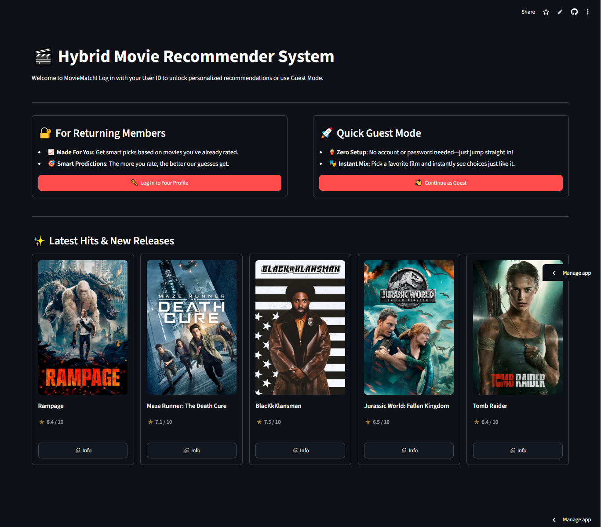

### B) User Page
To access User Mode, users are required to enter a valid User ID and Password.
- The system verifies the credentials against the registered user records.
- If the entered credentials do not match any existing account, a warning message will be displayed, and the user will be prompted to re-enter the correct User ID and Password.

 #### i) Invalid UserID
 

    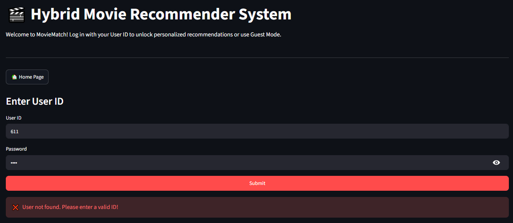
  

  
  #### ii) Invalid User password
  

    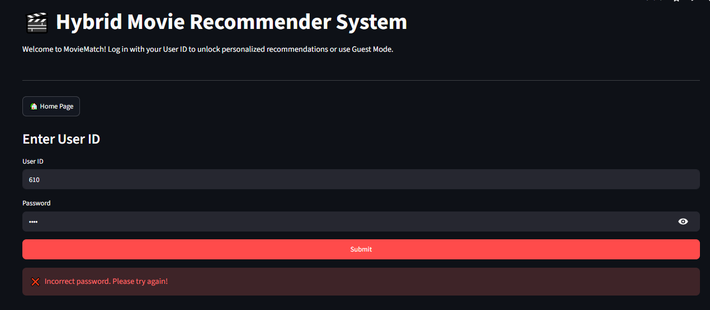
  

 #### iii) Successful Login
 After successful authentication, users can access personalized recommendation features.
 
 ##### iii(a) Personalized Recommendations (Collaborative Filtering)
- Users with sufficient rating history receive personalized movie recommendations generated using Item-Based Collaborative Filtering.

  

  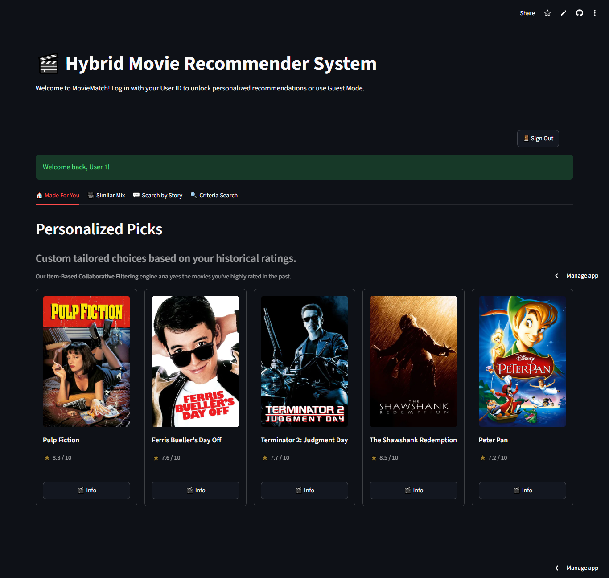
  

##### iii(b) Cold-Start Recommendations
- Users with insufficient rating history (fewer than 25 ratings) are identified as cold-start users. Instead of Collaborative Filtering, the system displays popularity-based movie recommendations.
  
  

  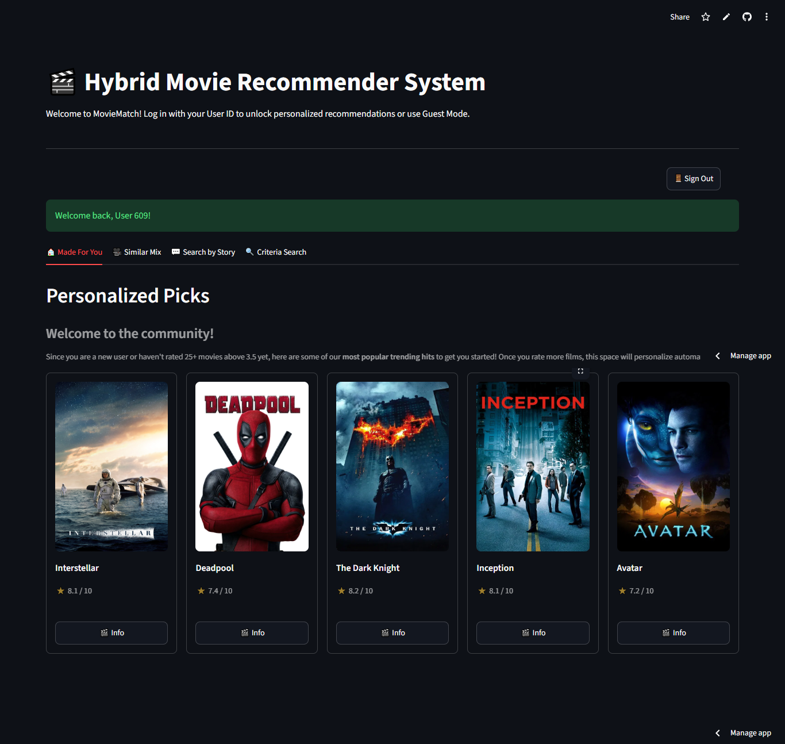
  

### C) Guest Page
- Guest Mode is intended for unregistered users without rating history. Similar to cold-start users, the system displays popularity-based recommendations instead of Collaborative Filtering results. The recommended movies are selected from the most popular titles in the dataset.

  

  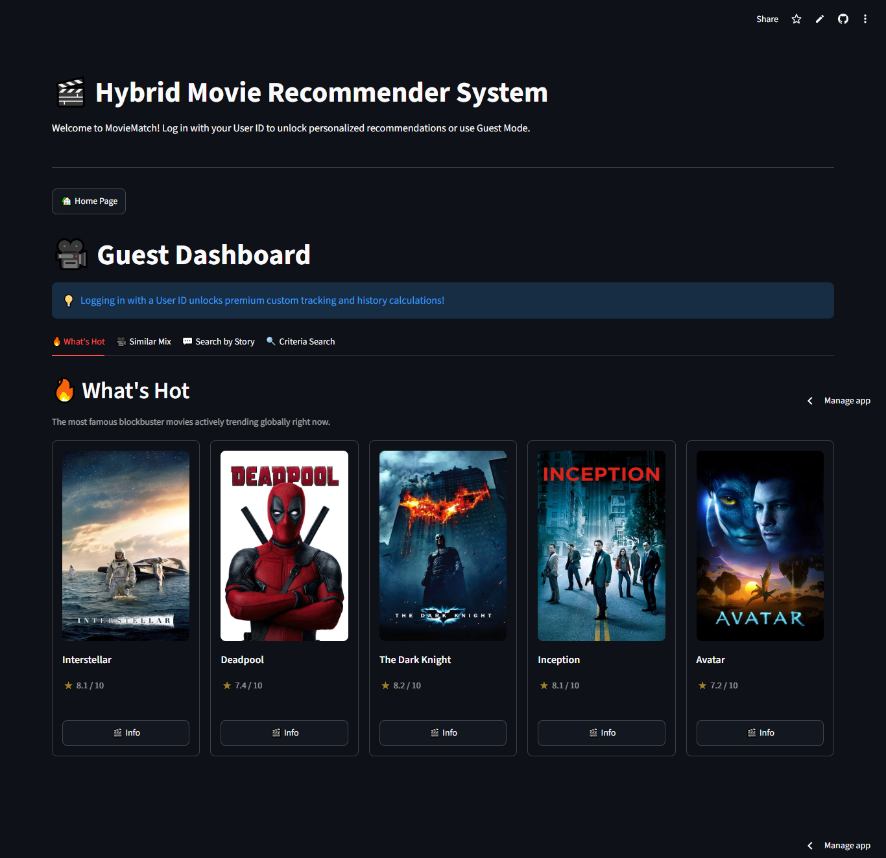
  

### D) Shared Features

The following features are available to both **User Mode** and **Guest Mode**. These modules allow users to discover movies through different recommendation and search approaches regardless of their login status.

#### i) 🎥 Similar Mix (Content-Based Filtering）
- Users can select a **movie title** and will receive recommendations for similar movies based on metadata such as genres, keywords, cast, directors, and movie overview.
- For example, when a user selects *Toy Story 3* in the Similar Mix feature, the system recommends movies with similar characteristics, such as *Toy Story*, *Toy Story 2*, *A Bug's Life*, and other Pixar animations. 

  

  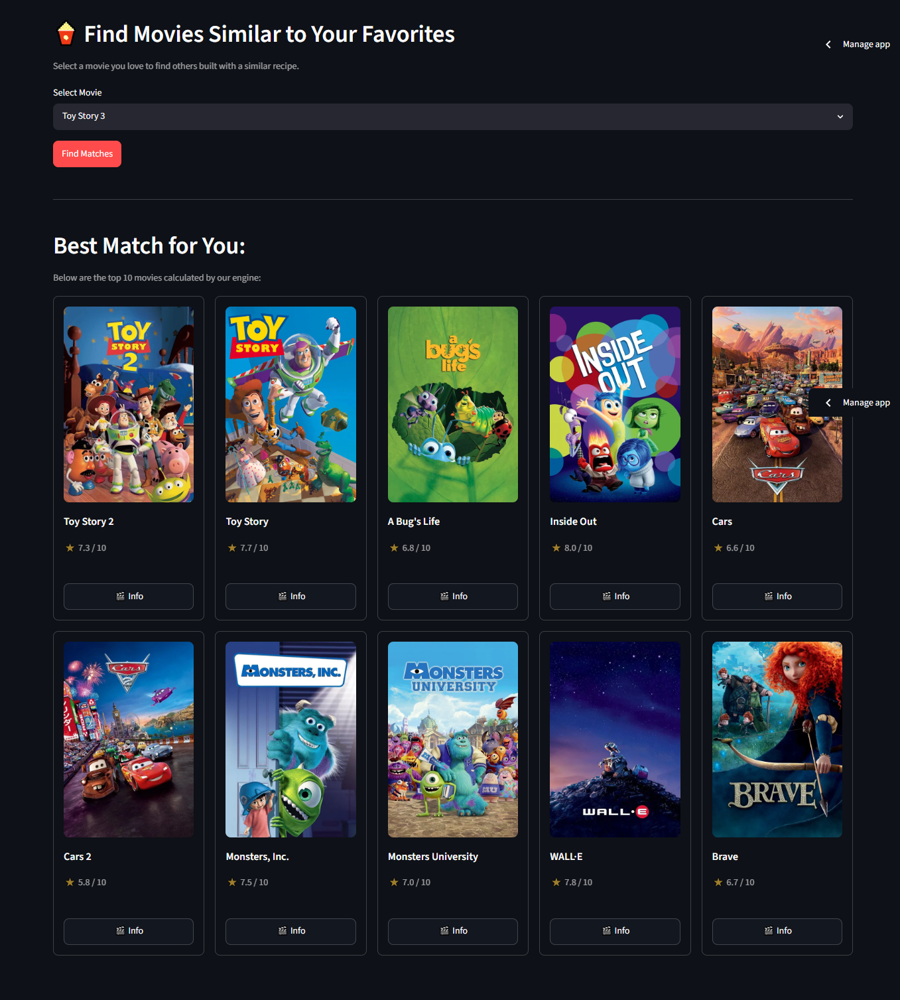
  

#### ii) 💬 Search by Story (NLP Semantic Search)
- This feature allows users to search for movies using **natural language descriptions** instead of exact movie titles.
- For example, a user can enter a query such as: “fantasy movies featuring a school of witchcraft and wizardry called Hogwarts”, and the system will return movies such as *Harry Potter* series based on semantic similarity.
- **Note**: The accuracy of the results depends on how well the query describes the movie. More detailed and meaningful descriptions will generally produce more accurate recommendations, while vague inputs may lead to less relevant results.

 

  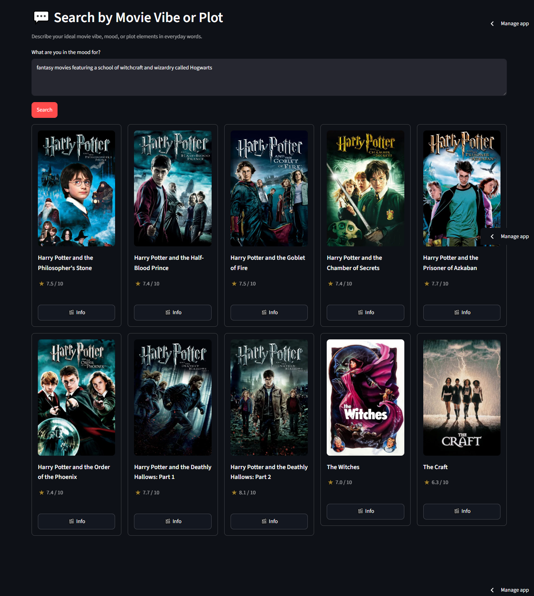
  

  #### iii) 🔍 Criteria Search (Filtering by Features)
Users can narrow down movie results by selecting criteria such as genres, actor/actress, or director. The system then returns movies that strictly match the selected features from the dataset.
- For example, a user can filter by the genre **“Animation”**, actor **“Tom Hanks”**, or director **“Christopher Nolan”** to retrieve a list of movies that match these conditions.
- The results are displayed with pagination, with a **maximum of 20 movies per page**. Users can navigate through additional results by clicking the **“Next Page”** button.
- Additionally, users can sort the results in different orders, including by rating, release year or title, allowing them to view movies based on their preferred ranking criteria. (Default is ratings highest to lowest)

 #### iii(a) 🎥 Browse by Genre
  

  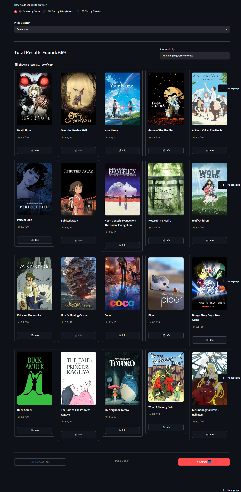
  

 #### iii(b) 🎭 Find by Actor/Actress
  

  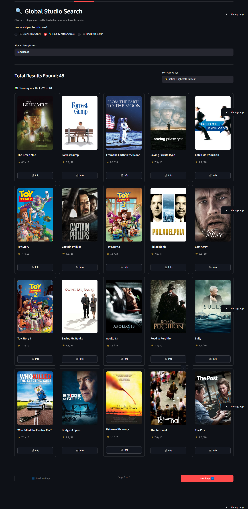
  

 #### iii(c) 🎬 Find by Director
  

  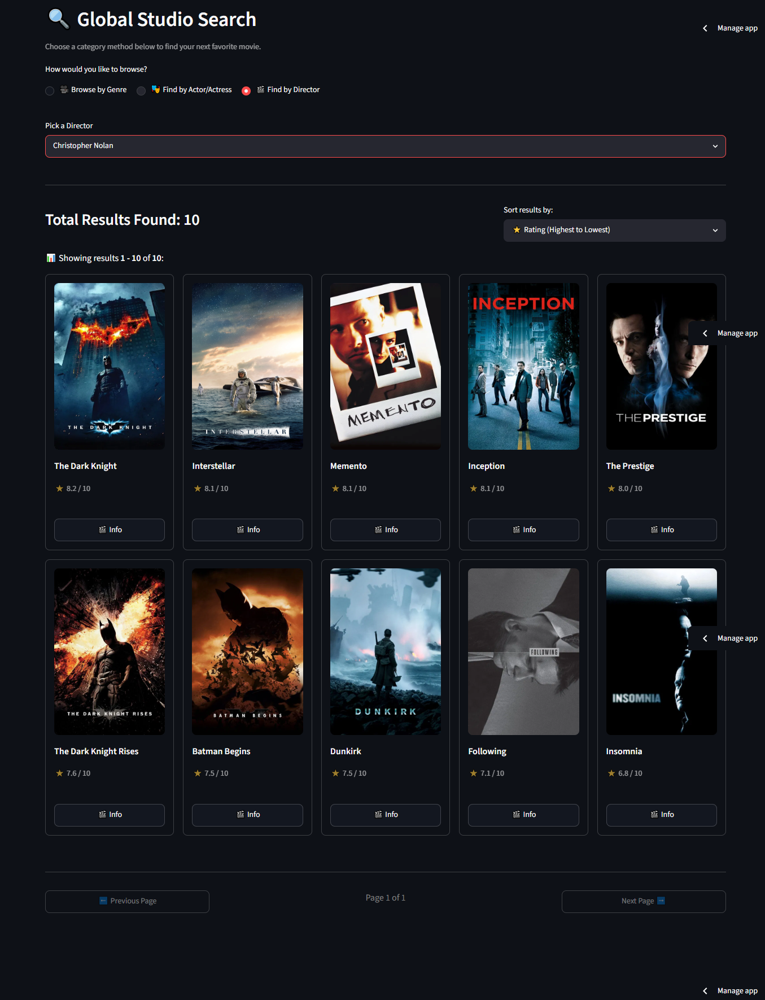
  

### E) Additional Features

Across both Guest Mode and User Mode, each movie displayed in the system includes an “🎬 Info ” button. When selected, a pop-up window is triggered, displaying detailed information about the movie.

The pop-up includes the movie poster along with key metadata such as title, genres, overview, cast, director, production companies, runtime, and release date. This feature allows users to quickly access detailed movie information without leaving the current page.

 

  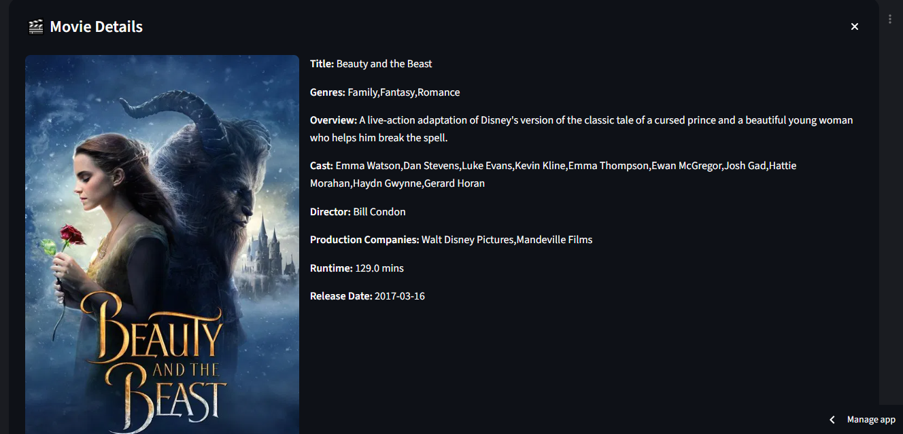
  

